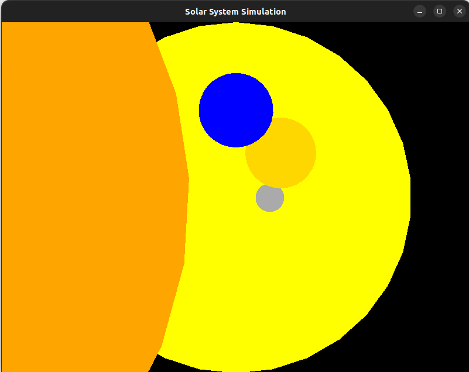
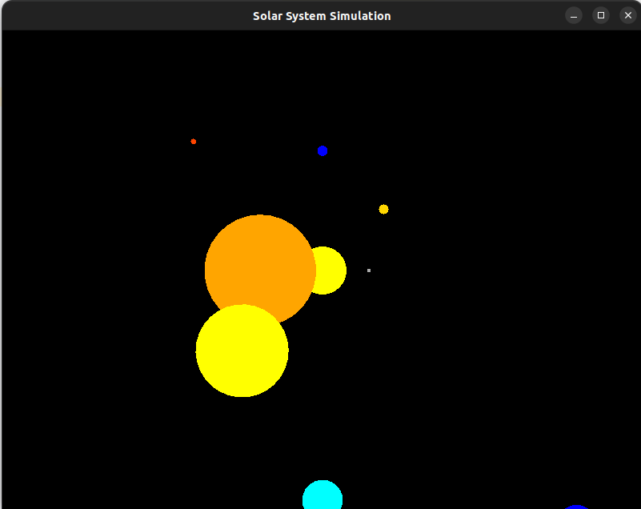

# Solar_System_Visualization


## Project Description
This project is a visualization of the solar system using C++, SFML, PostgreSQL to learn C++ programming, graphics rendering, and database integration. 
The program renders the planets of the solar system and displays information about them, such as name, radius, and distance from the sun. 
It uses SFML for graphics rendering and PostgreSQL for data storage.

## Setup Instructions
To run this application, you'll need:
C++ compiler(g++ or clang++)
SFML library
PostgreSQL library(pqxx)

Installing SFML
If you haven't installed SFML library, you can install it using your package manager. For example, on Ubuntu:
```bash
sudo apt-get update
sudo apt-get install libsfml-dev
```

Installing PostgreSQL(pqxx)
If you haven't installed PostgreSQL library, you can install it using your package manager. For example, on Ubuntu:
```bash
sudo apt-get update
sudo apt-get install libpqxx-dev
```

### How it Works
The program visualizes the solar system using SFML for graphics rendering and PostgreSQL for data storage. Here's how it works:

1.**Initialization:**

The program initializes SFML for graphics rendering and PostgreSQL for data storage.

2.**Database Connection:**

The program connects to the PostgreSQL database to retrieve data about the solar system.

3.**Rendering Planets:**

The program renders the planets of the solar system using SFML graphics.

4.**Displaying Information:**

The program displays information about the planets, such as name, radius, and distance from the sun.

5.**Event Handling:**

The program continuously polls for SFML events.

6.**Main Loop:**

The main loop of the program clears the screen, renders the planets, updates the display, and adds a delay to control the frame rate.

### Setting up the Database
To set up the PostgreSQL database, you can use the provided SQL script to create the necessary tables and insert data. Run the following command to create the database and tables:
```bash
sudo -u postgres psql
CREATE DATABASE database_name;
\c database_name
```

Connect to the database on CLion.

Create the tables and insert data using the console.sql file:

console.sql
```bash
CREATE TABLE planets (
name VARCHAR PRIMARY KEY,
radius FLOAT,
distance FLOAT,
orbit_speed FLOAT,
rotation_speed FLOAT,
color INTEGER,
position_x FLOAT,
position_y FLOAT
);


INSERT INTO planets (name, radius, distance, orbit_speed, rotation_speed, color, position_x, position_y) VALUES
('Sun', 30.0, 0.0, 0.0, 0.0, 0xffff00, 400.0, 300.0),
('Mercury', 2.44, 57.91, 4.74, 10.83, 0xaaaaaa, 400.0 + 57.91 * cos(0.0), 300.0 - 57.91 * sin(0.0)),
('Venus', 6.05, 108.2, 3.5, 6.52, 0xffd700, 400.0 + 108.2 * cos(2 * PI() / 8 * 1), 300.0 - 108.2 * sin(2 * PI() / 8 * 1)),
('Earth', 6.37, 149.6, 2.98, 7.92, 0x0000ff, 400.0 + 149.6 * cos(2 * PI() / 8 * 2), 300.0 - 149.6 * sin(2 * PI() / 8 * 2)),
('Mars', 3.39, 227.9, 2.41, 4.05, 0xff4500, 400.0 + 227.9 * cos(2 * PI() / 8 * 3), 300.0 - 227.9 * sin(2 * PI() / 8 * 3)),
('Jupiter', 69.9, 778.3, 1.31, 12.6, 0xffa500, 400.0 + 778.3 * cos(2 * PI() / 8 * 4), 300.0 - 778.3 * sin(2 * PI() / 8 * 4)),
('Saturn', 58.2, 1427, 0.97, 9.87, 0xffff00, 400.0 + 1427 * cos(2 * PI() / 8 * 5), 300.0 - 1427 * sin(2 * PI() / 8 * 5)),
('Uranus', 25.4, 2871, 0.68, 6.49, 0x00ffff, 400.0 + 2871 * cos(2 * PI() / 8 * 6), 300.0 - 2871 * sin(2 * PI() / 8 * 6)),
('Neptune', 24.6, 4495, 0.54, 5.43, 0x0000ff, 400.0 + 4495 * cos(2 * PI() / 8 * 7), 300.0 - 4495 * sin(2 * PI() / 8 * 7));

```

## Project Structure
The project directory contains the following files:

1.**main.cpp:**
2.**Database.cpp:**
3.**Database.hpp:**
4.**Planet.cpp:**
5.**Planet.hpp:**
6.**CMakeLists.txt:**
7.**console.sql:**

#### Running the Application

After installing the required libraries, navigate to the project directory and build the application using CMake:
```bash

mkdir build
cd build
cmake ..
make
# Set the DB_CONNECTION_STRING environment variable to connect to the database
export DB_CONNECTION_STRING="dbname=your_database_name user=your_username password=your_password hostaddr=your_hostaddress port=your_port_number" 
# Run the application
./Solar_System_Visualization
```
 

## Update the data to include all the planets in the screen

console.sql
```bash

INSERT INTO planets (name, radius, distance, orbit_speed, rotation_speed, color, position_x, position_y) VALUES
 ('Sun', 30.0, 0.0, 0.0, 0.0, 0xffff00, 400.0, 300.0),
 ('Mercury', 2.44, 57.91, 4.74, 10.83, 0xaaaaaa, 400.0 + 57.91 * cos(0.0), 300.0 - 57.91 * sin(0.0)),
 ('Venus', 6.05, 108.2, 3.5, 6.52, 0xffd700, 400.0 + 108.2 * cos(2 * PI() / 8 * 1), 300.0 - 108.2 * sin(2 * PI() / 8 * 1)),
 ('Earth', 6.37, 149.6, 2.98, 7.92, 0x0000ff, 400.0 + 149.6 * cos(2 * PI() / 8 * 2), 300.0 - 149.6 * sin(2 * PI() / 8 * 2)),
 ('Mars', 3.39, 227.9, 2.41, 4.05, 0xff4500, 400.0 + 227.9 * cos(2 * PI() / 8 * 3), 300.0 - 227.9 * sin(2 * PI() / 8 * 3)),
 ('Jupiter', 69.9, 778.3, 1.31, 12.6, 0xffa500, 400.0 + (778.3/10) * cos(2 * PI() / 8 * 4), 300.0 - (778.3/10) * sin(2 * PI() / 8 * 4)),
 ('Saturn', 58.2, 1427, 0.97, 9.87, 0xffff00, 400.0 + (1427/10) * cos(2 * PI() / 8 * 5), 300.0 - (1427/10) * sin(2 * PI() / 8 * 5)),
 ('Uranus', 25.4, 2871, 0.68, 6.49, 0x00ffff, 400.0 + (2871/10) * cos(2 * PI() / 8 * 6), 300.0 - (2871/10) * sin(2 * PI() / 8 * 6)),
 ('Neptune', 24.6, 4495, 0.54, 5.43, 0x0000ff, 400.0 + (4495/10) * cos(2 * PI() / 8 * 7), 300.0 - (4495/10) * sin(2 * PI() / 8 * 7));
 
```





## Disclaimer

Please note that while the data used for the planets (such as radius, distance from the sun, orbit speed, and rotation speed) is based on real-world data, the positions of the planets in this application do not represent their real-world positions. The positions are calculated for the purpose of visualization in the application and are based on a simplified model where the orbits are circular and all in the same plane. In reality, the orbits of the planets are elliptical and inclined at different angles.

Furthermore, the distances and sizes of the planets have been scaled down significantly to fit within the window of the application. In reality, the distances between the planets and their sizes vary greatly.

Therefore, while this application provides a fun and interactive way to learn about the solar system, it should not be used as a source of accurate scientific information about the positions or movements of the planets.


